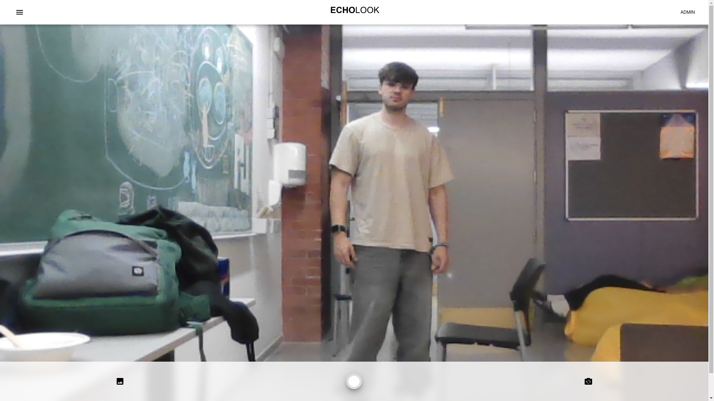
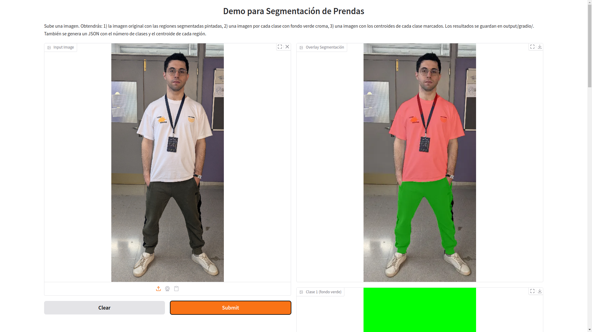
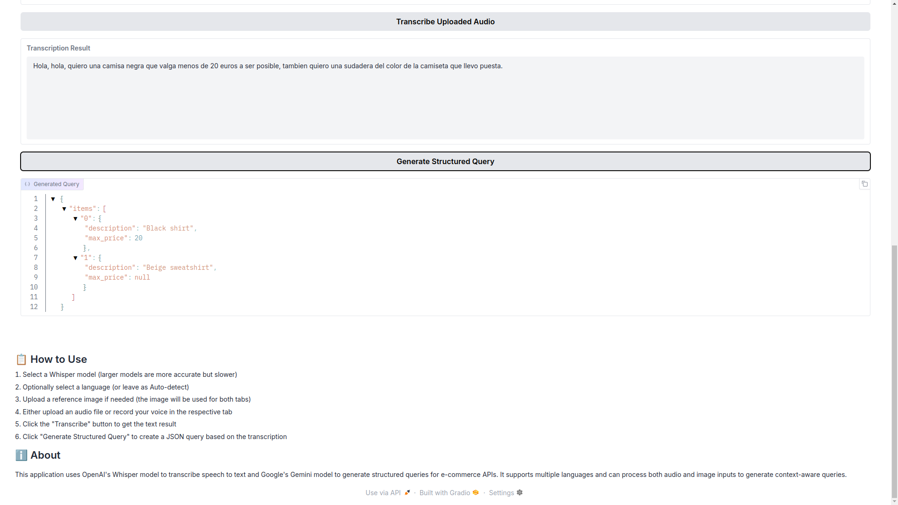
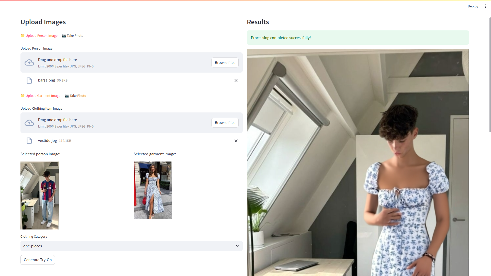
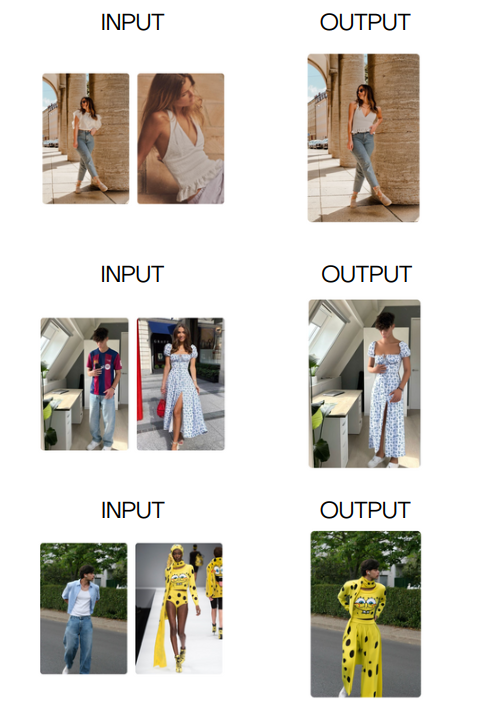
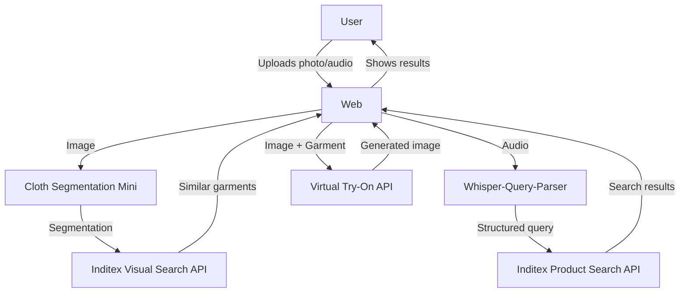
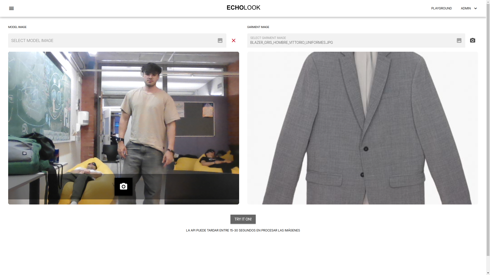

<div align="center">


**Find, try on, and buy clothes with artificial intelligence**

</div>

## 🌟 Modular functionalities
<div align="center">
<table> <tr> <td width="50%"> <h3 align="center">🔍 Visual Search</h3> <p align="center">  </p> <p align="center">Upload photos or take them instantly to find similar clothes</p> </td> <td width="50%"> <h3 align="center">👗 Clothing Segmentation</h3> <p align="center">  </p> <p align="center">Try on how clothes look on you before buying them</p> </td> </tr> <tr> <td width="50%"> <h3 align="center">🎤 Voice Search</h3> <p align="center">  </p> <p align="center">Describe what you're looking for and we'll find it</p> </td> <td width="50%"> <h3 align="center">🎭 Virtual Try-On</h3> <p align="center">  </p> <p align="center">Intelligent detection of garments in your photos</p> </td> </tr> </table>
</div>

## fashIA examples

<p align="center">  </p>

## 🚀 Project Architecture



## 🛠️ Technical Components

### 1. Cloth Segmentation Mini

Clothing segmentation module that uses a U2NET model to identify and classify garments into:

* 🔴 Upper clothing (class 1)
* 🟢 Lower clothing (class 2)
* 🔵 Full body clothing (class 3)

### 2. Whisper-Query-Parser

Converts voice commands into structured queries:

* 🎙️ Audio to text transcription (OpenAI Whisper)
* 🧠 Generation of structured queries (Google Gemini)
* 🖼️ Contextualization with images

### 3. Virtual Try-On

Allows virtual garment try-on:

* 📱 Simple Streamlit interface
* 🎯 Realistic visualization
* ⚡ Fast processing with Fashn.ai API

## 💻 Technologies Used

<div align="center">


</div>

## 🏗️ Installation adn Usage

### Prerequisites

```bash
# Install FFmpeg for audio processing
# Ubuntu/Debian
sudo apt-get install ffmpeg

# macOS
brew install ffmpeg

# Windows
# Download from https://ffmpeg.org/download.html
```

### Proyect Setup

1. **Clone repositorie**

```bash
git clone https://github.com/tu-usuario/fashionfinder.git
cd fashionfinder
```

2. **Install dependencies**

```bash
pip install -r requirements.txt
```

3. **Config env**

```bash
cp .env.example .env
# Edita .env con tus claves API:
# - GOOGLE_API_KEY para Gemini
# - FASHN_API_KEY para el try-on virtual
```

4. **Start services**

* Follow the guides in the respective READMEs

  TODO: COMO CORRER WEB

## 📱 Using the web in phone

### Visual Search

1. Upload a photo or take one with the camera
2. The image will be automatically segmented
3. Click on any detected garment to see similar options

### Voice Search

1. Click on the microphone button
2. Describe the garment you're looking for (e.g., "I want a blue short-sleeve t-shirt")
3. The system will translate your request and show relevant results

### Virtual Try-On

1. Select an image of yourself and a garment
2. Click on "Try-On"
3. Visualize how the garment would look on you without needing to try it on physically!

## 👥 Team

<div align="center">
  <table>
    <tr>
      <td align="center">
        <a href="https://github.com/manuamest">
          <sub>José Manuel Amestoy</sub>
        </a>
      </td>
      <td align="center">
        <a href="https://github.com/alejandrobujan">
          <sub>Alejandro Buján</sub>
        </a>
      </td>
      <td align="center">
        <a href="https://github.com/sergio-legazpi">
          <sub>Sergio Goyanes</sub>
        </a>
      </td>
    </tr>
  </table>
</div>

## 📝 License

This proyect is licensed under the MIT License - see the [LICENSE](LICENSE) file for more details.

[](https://hackupc.com)
[](https://inditex.com)
[](https://opensource.org/licenses/MIT)

## PLAYGROUND

Try our special feature, take photos or upload your own photos to the app and watch the magic happen!
    <p align="center">  </p> <p align="center">
