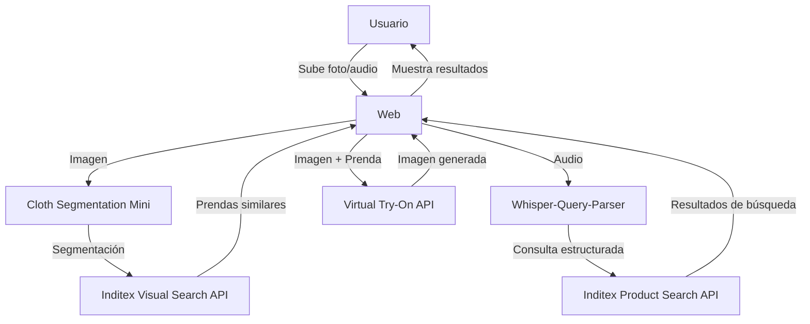

<div align="center">


**Encuentra, prueba y compra ropa con inteligencia artificial**
</div>

## Demo

<div align="center">


</div>

## 🌟 Funcionalidade modulares

<table>
  <tr>
    <td width="50%">
      <h3 align="center">🔍 Búsqueda Visual</h3>
      <p align="center">
        
      </p>
      <p align="center">Sube fotos o tómalas al instante para encontrar ropa similar</p>
    </td>
    <td width="50%">
      <h3 align="center">🎭 Prueba Virtual</h3>
      <p align="center">
        
      </p>
      <p align="center">Prueba cómo te queda la ropa antes de comprarla</p>
    </td>
  </tr>
  <tr>
    <td width="50%">
      <h3 align="center">🎤 Búsqueda por Voz</h3>
      <p align="center">
        
      </p>
      <p align="center">Describe lo que buscas y nosotros lo encontramos</p>
    </td>
    <td width="50%">
      <h3 align="center">👗 Segmentación de Ropa</h3>
      <p align="center">
        
      </p>
      <p align="center">Detección inteligente de prendas en tus fotos</p>
    </td>
  </tr>
</table>

## 🚀 Arquitectura del Proyecto



## 🛠️ Componentes Técnicos

### 1. Cloth Segmentation Mini

Módulo de segmentación de ropa que utiliza un modelo U2NET para identificar y clasificar prendas en:

- 🔴 Ropa superior (clase 1)
- 🟢 Ropa inferior (clase 2)
- 🔵 Ropa completa (clase 3)

### 2. Whisper-Query-Parser

Convierte comandos de voz en consultas estructuradas:

- 🎙️ Transcripción de audio a texto (OpenAI Whisper)
- 🧠 Generación de consultas estructuradas (Google Gemini)
- 🖼️ Contextualización con imágenes

### 3. Virtual Try-On

Permite probar virtualmente las prendas:

- 📱 Interfaz Streamlit sencilla
- 🎯 Visualización realista
- ⚡ Procesamiento rápido con Fashn.ai API

## 💻 Tecnologías Utilizadas

<div align="center">


</div>

## 🏗️ Instalación y Uso

### Requisitos Previos

```bash
# Instala FFmpeg para el procesamiento de audio
# Ubuntu/Debian
sudo apt-get install ffmpeg

# macOS
brew install ffmpeg

# Windows
# Descarga desde https://ffmpeg.org/download.html
```

### Configuración del Proyecto

1. **Clonar el repositorio**

```bash
git clone https://github.com/tu-usuario/fashionfinder.git
cd fashionfinder
```

2. **Instalar dependencias**

```bash
pip install -r requirements.txt
```

3. **Configurar variables de entorno**

```bash
cp .env.example .env
# Edita .env con tus claves API:
# - GOOGLE_API_KEY para Gemini
# - FASHN_API_KEY para el try-on virtual
```

4. **Iniciar los servicios**

- Seguir las guias de los respectivos README

5. **Accede a la aplicación**

- Abre tu navegador web y ve a `http://localhost:8501`

## 📱 Uso de la Aplicación

### Búsqueda Visual

1. Sube una foto o toma una con la cámara
2. La imagen se segmentará automáticamente
3. Haz clic en cualquier prenda detectada para ver opciones similares
4. Añade a favoritos o prueba virtualmente las prendas encontradas

### Búsqueda por Voz

1. Haz clic en el botón del micrófono
2. Describe la prenda que buscas (ej. "Quiero una camiseta azul de manga corta")
3. El sistema traducirá tu petición y mostrará resultados relevantes

### Prueba Virtual

1. Selecciona una imagen tuya y una prenda
2. Haz clic en "Generar Try-On"
3. ¡Visualiza cómo te quedaría la prenda sin necesidad de probártela físicamente!

## 🧠 Estructura del Proyecto

```
TODO
```

## 👥 Equipo

<div align="center">
  <table>
    <tr>
      <td align="center">
        <a href="https://github.com/manuamest">
          <sub>José Manuel Amestoy</sub>
        </a>
      </td>
      <td align="center">
        <a href="https://github.com/alejandrobujan">
          <sub>Alejandro Buján</sub>
        </a>
      </td>
      <td align="center">
        <a href="https://github.com/sergio-legazpi">
          <sub>Sergio Gollanes</sub>
        </a>
      </td>
    </tr>
  </table>
</div>

## 📝 Licencia

Este proyecto está licenciado bajo la Licencia MIT - ver el archivo [LICENSE](LICENSE) para más detalles.

[](https://hackupc.com)
[](https://inditex.com)
[](https://opensource.org/licenses/MIT)
